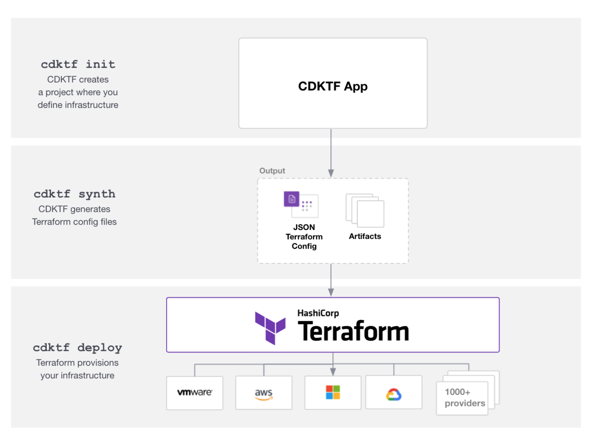
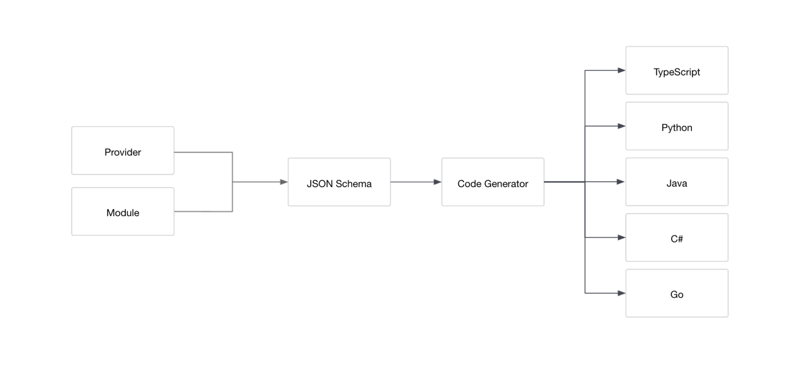
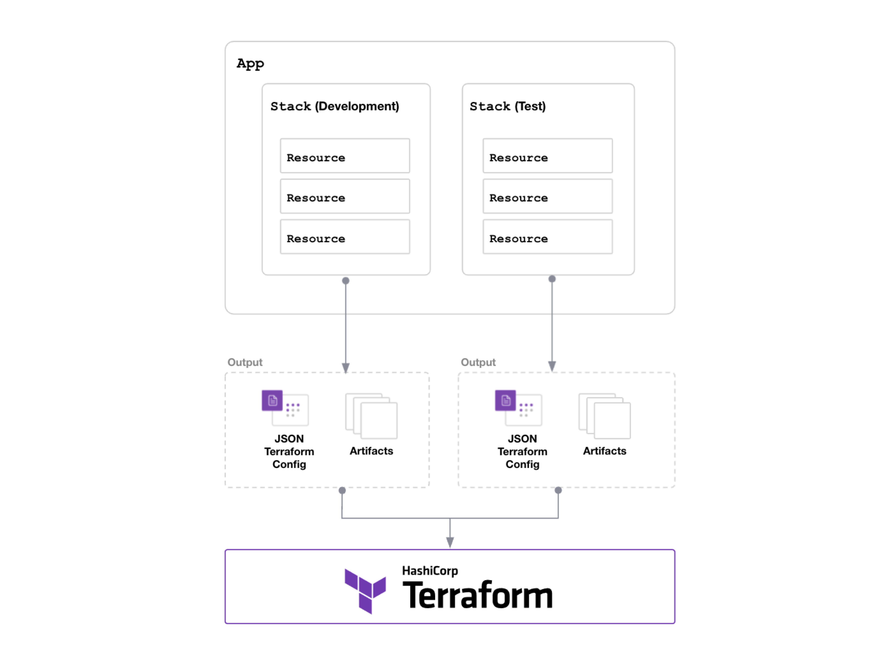

# Architecture

This page explains the tools and processes that CDK for Terraform (CDKTF) uses to leverage the Terraform ecosystem and convert code into Terraform configuration files. It also explains the major components of a CDKTF application and how those pieces fit together.

## CDKTF Building Blocks

CDKTF leverages existing libraries and tools to help convert the definitions you write in your preferred programming language to Terraform configuration files. It also uses Terraform to provision and manage your infrastructure when you deploy your application.

### Amazon Web Services Cloud Development Kit

CDKTF shares core concepts and components with the [Amazon Web Services Cloud Development Kit](https://aws.amazon.com/cdk/) (AWS CDK), a tool that allows you to use familiar programming languages to define infrastructure on AWS CloudFormation. AWS CDK and CDK for Terraform are different products, and you cannot yet use [AWS CDK constructs](https://docs.aws.amazon.com/cdk/latest/guide/constructs.html) within CDKTF. We are actively working on an [interoperability layer](https://github.com/hashicorp/terraform-cdk/pulls?q=is%3Apr+is%3Aopen+label%3Afeature%2Faws-adapter) to enable this in future releases.

### jsii

The [`jsii` tool](https://aws.github.io/jsii/) enables publishing polyglot libraries in all supported languages from a single Typescript code base. CDKTF uses Typescript types to generate an assembly file that `jsii` uses to generate the code bindings for the other supported languages.

### Terraform

CDKTF [synthesizes](/cdktf/cli-reference/commands.html#synth) infrastructure defined in a supported programming language into [JSON configuration files](https://www.terraform.io/docs/language/syntax/json.html) that Terraform can use to manage infrastructure.

The diagram below shows how synthesizing a CDKTF application produces a series of artifacts in a designated output folder. You can then either use the JSON file with Terraform directly or provision your infrastructure using CDKTF CLI commands. All CDKTF CLI operations like `diff`, `deploy`, and `destroy` communicate with Terraform for execution.

CDKTF also automatically extracts the schemas from existing Terraform [providers](./providers.html) or [modules](./modules.html) and generates the necessary code bindings for your application.

## CDKTF Components

CDKTF has two major components that allow you to define and provision infrastructure.

- **Lib:** This is the `cdktf` package that is the foundation for each CDKTF project. It contains all of the core libraries that allow you to leverage the Terraform ecosystem and synthesize your application into Terraform configuration files.

- **CLI:** The [`cdktf` CLI](/cdktf/cli-reference/cli-configuration.html) allows you to initialize a new CDKTF project, adjust project settings, synthesize your infrastructure into Terraform configuration files, deploy your CDKTF application, and more. Refer to the [CLI commands documentation](/cdktf/cli-reference/commands.html) for more details. You can also use some Terraform CLI commands like `terraform apply` and `terraform destroy` directly, but we recommend using the available `cdktf cli` commands where possible.

## Application Architecture

CDKTF applications are structured as a tree of [constructs](https://github.com/aws/constructs), which the AWS documentation defines as "classes that define a 'piece of system state'". The foundational classes to build a CDKTF application are `App`, `Stack`, and `Resource`.

### `App` Class

Each CDKTF project has one or more `App` instances that act as a container for the infrastructure configurations you create and deploy. An `App` can have one or more [`Stacks`](./stacks.html) that represent a collection of related infrastructure.

### `Stack` Class

A `Stack` represents a collection of infrastructure resources that CDKTF synthesizes as a separate Terraform configuration. It is equivalent to a [Terraform working directory](https://www.terraform.io/docs/cli/init/index.html).

Stacks allow you to separate the state management within an application. For example, you may want to deploy and manage separate infrastructure resources for development and testing. Reference the [stack documentation](./stacks.html) for more details on when and how to use stacks in your project.

### `Resource` Class

A `Resource` represents the definition for one or more infrastructure objects. Resources and their required attributes vary depending on the provider. Reference the [providers and resources documentation](./providers-and-resources.html#resources) for more details.

### Constructs

Rather than defining resources by hand, you can leverage constructs to reuse existing resource configurations written in your programming language. For example, you might create a construct that describes a Kubernetes deployment, import it into your application, and customize the deployment via the exposed properties.

Here is an example of a [custom construct written in TypeScript](https://github.com/skorfmann/cdktf-hybrid-module/blob/7a84cbea62fbc3c3b7e92c00d75fcaad495cf29b/packages/cdktf-hybrid-module/lib/construct.ts) that creates a machine image. The exported interface allows users to specify the instance type and one or more tags. The rest of the configuration is defined in the construct and is abstracted from the consumer.

### Examples

Reference the [examples page](/docs/cdktf/examples.html) to see configured CDKTF applications in each supported programming language.
