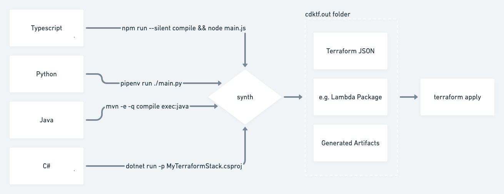

# Architecture

TBD INTRO

## CDKTF Building Blocks

CDKTF leverages existing libraries and tools to help convert the definitions you write in your preferred programming language to Terraform configuration files. It also uses Terraform to provision and manage your infrastructure when you deploy your application.

### Amazon Web Services Cloud Development Kit

CDK for Terraform shares core concepts and components with the [Amazon Web Services Cloud Development Kit](https://aws.amazon.com/cdk/) (AWS CDK), which allows you to use programming languages to define infrastructure resources on AWS CloudFormation. However, AWS CDK and CDK for Terraform are different products, and you can use CDKTF to leverage the entire Terraform ecosystem, including the [AWS provider](https://registry.terraform.io/providers/hashicorp/aws/latest). We are also actively working on an [interoperability layer](https://github.com/hashicorp/terraform-cdk/pulls?q=is%3Apr+is%3Aopen+label%3Afeature%2Faws-adapter) to use AWS CDK [constructs](#constructs) directly within CDKTF.

### jsii

The [`jsii` tool](https://aws.github.io/jsii/) enables publishing polyglot libraries in all supported languages from a single Typescript code base. CDKTF uses Typescript types to generate an assembly file that `jsii` uses to generate the code bindings for the other supported languages.

### Terraform

CDKTF is a conversion layer that [synthesizes](/cdktf/cli-reference/commands.html#synth) infrastructure defined in a supported programming language into [JSON configuration files](https://www.terraform.io/docs/language/syntax/json.html) that Terraform can use to manage infrastructure.

The diagram below shows how synthesizing a CDKTF application produces a series of artifacts in the `cdktf.out` folder. You can then either use the resulting JSON file with Terraform directly or with CDKTF CLI commands. All CDKTF CLI operations like `diff`, `deploy`, and `destroy` communicate with Terraform for execution.

CDKTF also automatically extracts the schemas from existing Terraform [providers](./providers.html) or [modules](./modules.html) and generates the necessary code bindings for your application.

## CDKTF Components

CDKTF has two major components that allow you to define and provision infrastructure.

- **Lib:** This is the `cdktf` package that is the foundation for each CDKTF project. It contains all of the core libraries that allow you to leverage the Terraform ecosystem and synthesize your application into Terraform configuration files.

- **CLI:** The [`cdktf` CLI](/cdktf/cli-reference/cli-configuration.html) allows you to initialize a new CDKTF project, adjust project settings, synthesize your infrastructure into Terraform configuration files, deploy your CDKTF application, and more. Refer to the [CLI commands documentation](/cdktf/cli-reference/commands.html) for more details. You also can use some Terraform CLI commands like `terraform apply` and `terraform destroy` directly, but we recommend using the available `cdktf cli` commands where possible.

## Application Architecture

CDKTF applications are structured as a tree of [constructs](https://github.com/aws/constructs), which the AWS documentation defines as "classes that define a 'piece of system state'". The key CDKTF classes are all derived from `Construct` and are represented as a node in the application tree, where the `App` node is the root.

### `App` Class

Each CDK for Terraform (CDKTF) project has one or more `App` instances. By default cdktf projects are designed to have one instance of `App`. However, one could have as many apps as desired within a project. The output path for each `App` instance has to be unique, to avoid conflicts between apps for the synthesized output.

TODO: Can we 1) explain why someone would want multiple apps and 2) explain how to configure this? The configuration may be moved to another page, but please add it here for now.

An `App` can have one or more [`Stacks`](./stacks.html) that represent a collection of infrastructure that will be synthesized as a dedicated Terraform configuration.

### `TerraformStack` Class

A `Stack`represents a collection of infrastructure which will be synthesized as a dedicated Terraform configuration. In comparison to Terraform, a Stack is equal to a dedicated working directory. Stacks are useful to separate the state management within an application which is useful in terms of blast radius. Furthermore, it allows to organize the application logically.

### `Resource` Class

TODO add something here.
