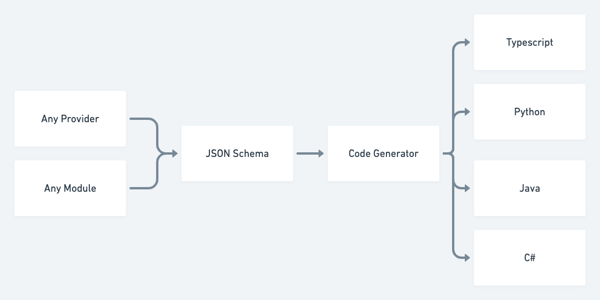
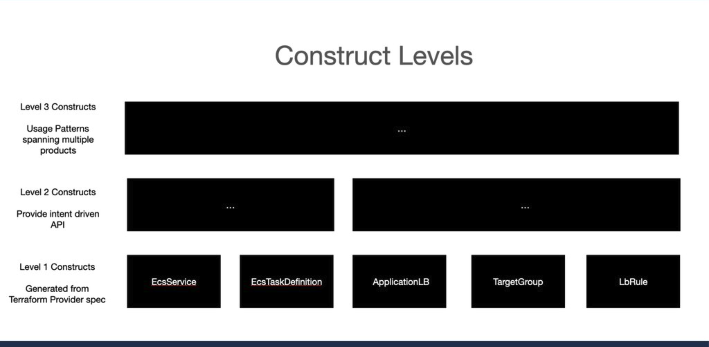

# Architecture

When you use CDKTF, you create an **application** that uses CDKTF libraries to convert infrastructure definitions into JSON configuration files for Terraform. An application can have one or more **stacks**, which represent a collection of infrastructure that will be synthesized as a dedicated Terraform configuration. This allows you to separate the state management for multiple environments with the same infrastructure, like test and production.

## Application

The `App` class is a logical concept to group instances of a `Stack` and provide global configuration to all its descendants.

The synthesized output of an `App` will be written to the configured `output` path (`cdktf.out` by default). By default cdktf projects are designed to have one instance of `App`. However, one could have as many apps as desired wihtin a project. The output path for each `App` instance has to be unique, to avoid conflicts between apps for the synthesized output.

### Application Context

One option to provide global configuration is the app `context`, which can be accessed in any construct within the app.

```typescript
import { Construct } from "constructs";
import { App, TerraformStack } from "cdktf";
import { AwsProvider, Instance } from "./.gen/providers/aws";

class MyStack extends TerraformStack {
  constructor(scope: Construct, id: string) {
    super(scope, id);

    new AwsProvider(this, "aws", {
      region: "us-east-1",
    });

    new Instance(this, "Hello", {
      ami: "ami-2757f631",
      instanceType: "t2.micro",
      tags: {
        myConfig: this.constructNode.getContext("myConfig"),
      },
    });
  }
}

const app = new App({ context: { myConfig: "config" } });
new MyStack(app, "hello-cdktf");
app.synth();
```

The other way to define global configuration would be the [cdktf.json]() config file TODO: add link

## Stack

A stack represents a collection of infrastructure which will be synthesized as a dedicated Terraform configuration. In comparision to Terraform, a Stack is equal to a dedicated working directory. Stacks are useful to separate the state management within an application which is useful in terms of blast radius. Furthermore, it allows to organize the application logically.

### A single Stack

The following example will synthesize a single Terraform configuration in the configured output folder. When running `cdktf synth` we'll find the synthesized Terraform configuration in the folder `cdktf.out/stacks/a-single-stack`

```typescript
import { Construct } from "constructs";
import { App, TerraformStack } from "cdktf";
import { AwsProvider, Instance } from "./.gen/providers/aws";

class MyStack extends TerraformStack {
  constructor(scope: Construct, id: string) {
    super(scope, id);

    new AwsProvider(this, "aws", {
      region: "us-east-1",
    });

    new Instance(this, "Hello", {
      ami: "ami-2757f631",
      instanceType: "t2.micro",
    });
  }
}

const app = new App();
new MyStack(app, "a-single-stack");
app.synth();
```

### Multiple Stacks

The following example will synthesize multiple Terraform configurations in the configured output folder.

```typescript
import { Construct } from "constructs";
import { App, TerraformStack } from "cdktf";
import { AwsProvider, Instance } from "./.gen/providers/aws";

interface MyStackConfig {
  environment: string;
  region?: string;
}

class MyStack extends TerraformStack {
  constructor(scope: Construct, id: string, config: MyStackConfig) {
    super(scope, id);

    const { region = "us-east-1" } = config;

    new AwsProvider(this, "aws", {
      region,
    });

    new Instance(this, "Hello", {
      ami: "ami-2757f631",
      instanceType: "t2.micro",
      tags: {
        environment: config.environment,
      },
    });
  }
}

const app = new App();
new MyStack(app, "multiple-stacks-dev", { environment: "dev" });
new MyStack(app, "multiple-stacks-staging", { environment: "staging" });
new MyStack(app, "multiple-stacks-production-us", {
  environment: "production",
  region: "us-east-1",
});
new MyStack(app, "multiple-stacks-production-eu", {
  environment: "production",
  region: "eu-central-1",
});
app.synth();
```

After running `cdktf synth` we can see the following synthesized stacks:

```
$ cdktf list

Stack name                      Path
multiple-stacks-dev             cdktf.out/stacks/multiple-stacks-dev
multiple-stacks-staging         cdktf.out/stacks/multiple-stacks-staging
multiple-stacks-production-us   cdktf.out/stacks/multiple-stacks-production-us
multiple-stacks-production-eu   cdktf.out/stacks/multiple-stacks-production-eu
```

### Current Limitations

#### Deployments

At the moment all Terraform operations are limited to a single stack. In order to run `diff`, `deploy` or `destroy`, a target stack has to be specified. A deploy command like `cdktf deploy multiple-stacks-dev` will work and all Terraform operations will run in the folder `cdktf.out/stacks/multiple-stacks-dev`.

Omitting the target stack by running a plain `cdktf deploy` will result in error. This will change in future versions, where support for targeting all or a subset of stacks will be added.

Please track this [issue](https://github.com/hashicorp/terraform-cdk/issues/650) when you're interested in this feature.

#### Cross Stack References

Referencing resources from another stack is not yet supported automatically. It can be achieved manually by using [Outputs](website/docs/cdktf/concepts/variables-and-outputs.html.md) and the [Remote State data source](https://www.terraform.io/docs/language/state/remote-state-data.html).

Please track this [issue](https://github.com/hashicorp/terraform-cdk/issues/651) when you're interested in this feature.

## jsii

jsii is the runtime for CDK for Terraform projects, when using languages other than Typescript or Javascript. jsii enables publishing polyglot libraries in all supported languages - currently Python, Java, C# and Go (experimental) from a single Typescript code base. Typescript types are used to generate a jsii assembly file, which serves as the basis to generate the code bindings for the other supported languages. Find more about the [jsii Runtime Architecture](https://aws.github.io/jsii/overview/runtime-architecture/) or explore the [jsii docs](https://aws.github.io/jsii/) in general.

## AWS CDK

CDK for Terraform shares core concepts and components with the [AWS CDK](https://aws.amazon.com/cdk/) which were extracted into `jsii` and `constructs`. Nevertheless, AWS CDK and CDK for Terraform are different products. While we're [actively working](https://github.com/hashicorp/terraform-cdk/pulls?q=is%3Apr+is%3Aopen+label%3Afeature%2Faws-adapter) on an interoperability layer to use AWS CDK constructs within CDK for Terraform, it's not limited to this. You can leverage the entire Terraform ecosystem with CDK for Terraform.

## CDK for Terraform / Terraform

CDK for Terraform is a layer on top of Terraform.

We use the [provider schema](https://www.terraform.io/docs/cli/commands/providers/schema.html) as a basis to generate code bindings. Since there is no schema beyond Terrraform HCL for Modules, we analyze the Module structure and use this as a basis to generate code bindings for these. This means, any provider and module can be used within CDK for Terraform.



All operations like diff, deploy and destroy are relying on Terraform as well. To make this happen, applications are synthesized from the language they are written in, into a HCL compatible [JSON format](https://www.terraform.io/docs/language/syntax/json.html)


## CDK for Terraform CLI / Lib

### CLI

The cdktf cli serves as tool to work with the project (init, generate providers) and to diff, deploy and destroy stacks. It's relying on Terraform and therefore expects the Terraform CLI to be present. Since each stack is synthesized as a self contained Terraform config into it's own dedicated working directory in `cdktf.out`, it's possible to fallback to the Terraform CLI for operations like apply and destroy. However, the cdktf CLI abstracts the workflows and does some additional sanity check, so this should be the default way of operating a cdktf project.

Note: `cdktf.out` folder is ephemeral and might be erased for each `synth` which happens implicitly when deploying, diffing or destroying your app. That's the reason why local state files are kept in the root directory of a cdktf project.

### Lib

The cdktf package is the foundation for each CDK for Terraform project. It's available in all supported languages and models core concepts of a CDK for Terraform app (`App`, `TerraformStack`, `TerraformOutput`, etc). In addition to this, it encapsulates the logic of `synthesizing` a `TerrfaormStack` to HCL compatible JSON and dealing with `TerraformAssets`.

## Synth

`synth` is the process of rendering your application into a self contained Terraform config, including any assets you might have defined.

## Constructs

CDK for Terraform apps are structured as a tree of [constructs](https://github.com/aws/constructs). The classes `App`, `TerraformStack`, `TerraformResource` and `Resource` are all deriving from `Construct` and are therefore represented as a node in the application tree, where the `App` node is the root.

### Levels of Abstraction

Conceptually, we talk about different levels of constructs. The generated provider bindings are Level 1 (L1) constructs. A Level 2 (L2) constructs is usually composing one or more L1 constructs and should aim to provide an intent driven API for easy consumption. Level 3 (L3) constructs are usually representing common patterns and larger pieces of functionality. While there's no theoretical limit in adding more levels of abstractions, it's often not desireable.

The overall goal should be, to come up with a set of composable constructs, to encourage an expressive, intent driven API which is easy to maintain.



### Terraform Modules vs Constructs

While both, Terraform Modules and cdktf Constructs share the same idea of allowing to encapsulate a set of resources, there are conceptual differences. Since Constructs are plain classes in your chosen programming language, they enable composition of complex objects while maintaining type safety.

A Terraform Module creates a namespace for all resources, so the implementation details are hidden from the consumer. Constructs on the other hand, are synthesized within the `Stack` they are instantiated in, without an additional namespace.

[cdktf convert](TODO) can be used to convert any HCL project and therefore modules as well into cdktf projects. This could be used as a starting point to create a custom construct. At the moment, there is no built-in way in cdktf to create a Terraform module from a Construct. It'd be still be possible to use the synthesized output of a cdktf project as a Terraform Module, details can be found [here](website/docs/cdktf/concepts/hcl-interoperability.html.md)

### Constructs vs Stacks

Stacks will `synthesize` to a dedicated Terraform configuration and are useful to separate Terraform state and enable to create multiple instances of the same configuration with slighlty different parameters, i.e. multi-region deployments or things like dev, staging and production environments. In short, it's a concept of a deployable unit.

Constructs on the other hand, provide a way to logical structure a set of resource. A Construct can only be used as part of a Stack.

### Generated Resource Name

To avoid naming conflicts, a stable unique name is inferred from the `Construct#id` and the position of the `Construct` instance within the `Construct` tree.

### Aspects / Visitor

`Aspects` enable you to implement a visitor pattern, to dynamically add or remove Constructs, or change attributes of existing Constructs as part of the `synth` process. One example of where this can be useful: When you want to tag all or a subset of Terraform Resources based on dynamic conditions. An `Aspect` could also be used, to dynamically configure Terraform Providers or to change code of Lambda functions.

## Programming Languages

CDK for Terrform supports the following programming languages at the moment:

### Generally Available

- Typescript / Javascript
- Python
- C#
- Java

### Experimental

- Go

### Feature Parity

CDK for Terraform uses `jsii` to enable cross language support while the core of cdktf is written in Typescript. We strive to have feature parity and good UX across all supported languages which are generally available. There might be cases, where new features and UX might not meet this goal for experimentally supported lanaguages.

### Choosing a Language for your Project

We encourage you to use the language you're most familiar with and which fits the broader landscape of your organisation to build cdktf applications.

If you're planning to distribute construct libraries as open source package or within your organisation, it's best to use Typescript and leverage `jsii` to generate native packages for all desired language targets. In particular for open source projects, we'd recommend to aim to support all generally available platforms.

#### Constructs Package Template

There is a [cdktf constructs](https://github.com/projen/projen#getting-started) package generator, which scaffolds an entire Github project including the necessary Github Actions workflows for building and publishing packages in all languages via `jsii`.
