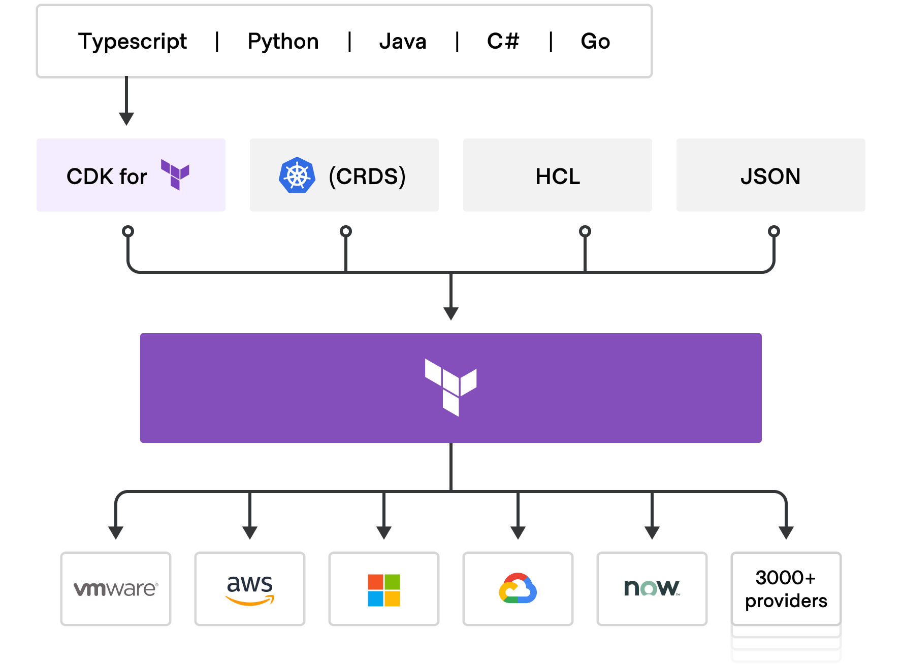

# What is CDK for Terraform?

Cloud Development Kit for Terraform (CDKTF) allows you to use familiar
programming languages to define and provision infrastructure. This gives you access to the entire Terraform ecosystem without learning HashiCorp Configuration Language (HCL) and lets you leverage the power of your existing toolchain for testing, dependency management, etc.

We currently support TypeScript, Python, Java, C#, and Go (experimental).

## How does CDK for Terraform work?

CDK for Terraform leverages concepts and libraries from the [AWS Cloud Development Kit](https://aws.amazon.com/cdk/) to translate your code into infrastructure configuration files for Terraform.

At a high level, you will:

1. **Create an Application:** Use either a built-in or a custom template to scaffold a project in your chosen language.
2. **Define Infrastructure:** Use your chosen language to define the infrastructure you want to provision on one or more providers. CDKTF automatically extracts the schema from Terraform providers and modules to generate the necessary classes for your application.
3. **Deploy**: Use `cdktf` CLI commands to provision infrastructure with Terraform or synthesize your code into a JSON configuration file that others can use with Terraform directly.

You can use every Terraform provider and module available on the [Terraform Registry](https://registry.terraform.io/), and you can use CDKTF with [Terraform Cloud](https://www.terraform.io/docs/cloud/index.html), [Terraform Enterprise](https://www.terraform.io/docs/enterprise/index.html), and HashiCorp's policy as code framework, [Sentinel](https://www.hashicorp.com/sentinel). However, as CDKTF is under active development, we do not yet recommend it for production use cases (more details in [Project Maturity](#project-maturity) below).

## When to use CDK for Terraform

**TODO:** Insert content about when folks should use this instead of HCL... link to HCL interoperability page.

## Project Maturity

CDK for Terraform is under active development, and we are iterating fast to improve the product. This means that each major release typically introduces breaking changes. As an early adopter, you may encounter bugs and may sometimes need to use HCL as a workaround. Our goal is to provide a user experience where this is an exceptional edge case, and we appreciate your feedback as the project progresses.

While you can use CDKTF with Terraform Cloud and Terraform Enterprise, it is not eligible for commercial support and we do not officially recommend it for production use cases. Some early-adopters are already using CDK for Terraform in production, and we are working with them to validate and improve workflows.

## Get Started

- [Install CDKTF](https://learn.hashicorp.com/tutorials/terraform/cdktf-install?in=terraform/cdktf) and set up your first project on HashiCorp Learn.
- Learn about [CDKTF application architecture](/docs/cdktf/concepts/architecture.html)
- Learn how to use key CDKTF concepts like [providers](/docs/cdktf/concepts/fundamentals/providers.html), [modules](/docs/cdktf/concepts/fundamentals/modules.html), and [resources](/docs/cdktf/concepts/fundamentals/resources.html) to define infrastructure

